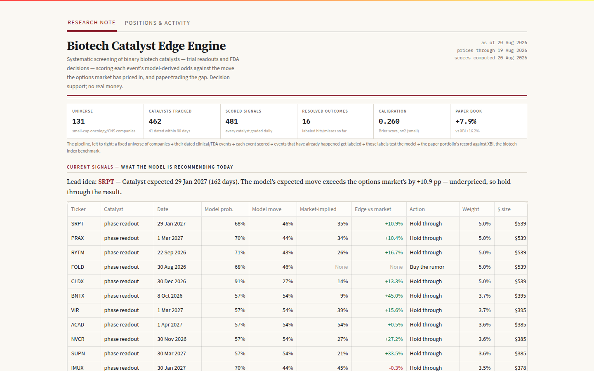

# GBM / Onc-CNS Edge Engine

**A research pipeline that estimates whether small-cap oncology/CNS biotech stocks are
mispriced ahead of clinical-trial readouts and FDA decisions — and turns that estimate
into sized, typed paper trades.**




*The dashboard is a one-page research note: what the system does, what it recommends,
whether it works, and how much data is behind it — on one screen.
[Full note](docs/img/note_full.png) ·
[printable memo](docs/report_sample.pdf)*

## The numbers, as they actually are

Queried from the live database on **2026-08-17** (regenerate: `python scripts/db_inventory.py`):

| Metric | Value | Note |
|--------|-------|------|
| Universe companies | 106 (131 tracked, 17 GBM-flagged) | small-cap oncology/CNS |
| Upcoming catalysts | 462 (42 in next 90 days) | 451 readouts · 8 PDUFA · 3 adcom |
| Scored signals | 481 → 222 long, 259 avoid | long-only; fades retired on evidence |
| Base-rate model holdout | Brier skill +0.098 · AUC 0.676 | n = 10,127 labeled trials, temporal split (2026-06-21) |
| Resolved catalyst outcomes | 15 (1 hit / 1 miss / 13 ambiguous) | **small — calibration is just getting started** |
| Calibration vs outcomes | Brier 0.260, n = 2 | printed as-is; near-empty samples are the honest state |
| Event study | 2,214 real 8-K events, 6,831 return rows | median 3d abnormal ≈ −1%, std ≈ 22% |
| Historical trials mined | 52,341 (14,959 with success labels) | ClinicalTrials.gov |
| Price history | 145,938 rows · 115 tickers · through 2026-08-14 | yfinance EOD |
| Paper book | $10,438 (+4.4%) vs XBI +7.5% since 2026-06-28 | 31 open longs; young record, lagging a hot tape |

## Why this exists

Small-cap biotech is a market built on binary events, and the behavior around those
events repeats: prices run up into the print, hype concentrates in names with weak
historical odds, and companies that can't fund themselves to their own catalyst get
diluted at the worst moment. I built this on a simple thesis: the **direction** of a
trial result is close to unforecastable, but the **odds** are estimable from history,
and the **crowd's pricing of those odds** is measurable. The tradeable quantity is the
gap between the two.

I anchor every score on base rates — how often trials like this one have actually
succeeded — and keep the model deliberately simple (few factors, near-equal weights),
the lesson of Kahneman, Sibony, and Sunstein's *Noise*. I tested the alternative: a
regularized logistic model with more features did not beat the plain lookup, so the
lookup stayed. And the discipline stance is the point: **trust nothing until
calibration and walk-forward backtesting show a positive edge on resolved outcomes.**
Every signal is paper-traded, every assumption measured — including the ones that
failed.

## What it does

Daily, from raw public data to a risk-capped trade book:

1. **Ingest** catalysts (trial readouts, PDUFA dates, advisory committees) from
   ClinicalTrials.gov; financials, 8-Ks, and Form 4 insider trades from SEC EDGAR;
   prices, short interest, and options data via yfinance.
2. **Anchor on base rates** — empirical P(success | phase, indication, sponsor class)
   mined from ~52k historical trials.
3. **Grade each catalyst** — proximity, base rate, balance-sheet survivability. No
   sentiment in the grade.
4. **Compare against the market** — the model's *expected move* vs the options
   market's *implied move* (the move traders have priced in). The difference is the
   **edge gap**, the mispricing estimate everything hangs on.
5. **Decide and size** — `buy_the_rumor` (ride the run-up, exit before the print),
   `hold_through` (own the binary when odds justify), or `avoid`; sized
   **Kelly-fractional** (the Kelly criterion's optimal fraction, taken at
   quarter-Kelly, capped at 5% per name). A fourth type, `fade`, was **retired after
   measurement** — no reliable edge, and the main paper-trading drag.
6. **Cap the risk** — sector/GBM/gross caps, a market-cap risk haircut, and EOD
   overlays (stop-loss, drawdown tiers, regime filter) that can only reduce exposure.
7. **Execute on paper** via a GitHub Actions autopilot; display in a Streamlit
   dashboard designed to read like an institutional research note.

```
ClinicalTrials.gov ┐
SEC EDGAR          ├─→ PostgreSQL (22 tables) ─→ decision engine ─→ action book
yfinance           ┘     layers/layer1·3·4, marketdata   layers/composite   (long-only)
                              │                                │
                     portfolio/ (tracker, risk)        validation: calibration,
                              │                          backtest, event study
                              ▼
              Streamlit terminal (scripts/terminal.py) + daily paper autopilot
```

## The one-pager

A printable research memo generated from live data — top signals, validation state,
equity vs XBI, catalyst calendar, coverage:
[docs/report_sample.html](docs/report_sample.html) ·
[docs/report_sample.pdf](docs/report_sample.pdf). Regenerate with
`python scripts/generate_report.py`.

## Quickstart

Python 3.12+ and Postgres (free [Supabase](https://supabase.com) project, or
`docker compose up -d` for local).

```bash
git clone https://github.com/diegoevrard07-cyber/biotech-db.git
cd biotech-db
python -m venv .venv && source .venv/bin/activate
pip install -r requirements.txt

cp .env.example .env
# edit .env: DATABASE_URL (Postgres) and SEC_USER_AGENT ("Name email" — SEC requirement)
# POE_API_KEY is optional — the Layer-2 science council is scaffolded, not wired in

python scripts/apply_schema.py     # create tables (idempotent)
python scripts/refresh_all.py      # full pipeline: ingest → score → validate (fail-soft)
streamlit run scripts/terminal.py  # the Edge Terminal
python -m pytest                   # 180+ tests (DB-backed tests skip w/o DATABASE_URL)
```

## Limitations & roadmap

1. **EOD granularity** — no intraday/overnight gap protection beyond the 5% per-name
   cap → next: intraday checks need a live feed.
2. **Resolved-outcome sample is tiny** (calibration n = 2) → accrues as the forward
   book resolves; re-run `scripts/calibrate.py` as outcomes land.
3. **The edge gap compares move magnitude, not signed return** → next: accumulate
   implied-move snapshots for a signed mispricing signal.
4. **Survivorship/lookahead risk** — the universe is today's listed names; guards are
   temporal holdouts and as-of backtest rules → next: point-in-time universe.
5. **Layer-2 science council** (LLM design critique) is scaffolded, not wired → next:
   connect it to the scorer's `science_score` slot.
6. **Paper trading only** — no transaction-cost, borrow, or slippage model → next:
   cost model before any real-money consideration.

## Disclaimer & license

Personal research project. Decision support only; all tracked positions are paper
trades. Not financial advice. MIT — see [LICENSE](LICENSE).

---

*More detail: [docs/PIPELINE.md](docs/PIPELINE.md) (full run order) ·
[docs/OPERATIONS.md](docs/OPERATIONS.md) (scheduling, hosting, risk overlays) ·
[docs/DATA.md](docs/DATA.md) (data sources, schema, Python notes) ·
[docs/AGENT_HANDOFF.md](docs/AGENT_HANDOFF.md) (project handbook) ·
[docs/OPERATIONS_LOG.md](docs/OPERATIONS_LOG.md) (change journal)*
