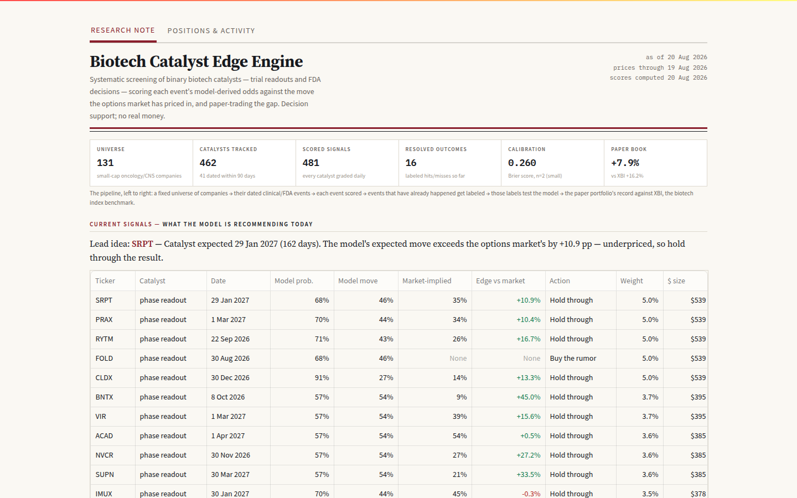

# Biotech Catalyst Edge Engine

A daily pipeline that scores upcoming small-cap biotech catalysts (trial readouts, FDA
decisions) against what the options market has priced in, and runs the result as a
paper portfolio. The most useful thing I found building it is a negative one: pre-event
price action predicts the *direction* of a biotech catalyst move about as well as a coin
flip (47.6% directional hit rate out of sample), so the model bets on base rates and
mispricing, never on calling which way the stock jumps.




## The interesting part

The idea I wanted to test is that for a binary event like a Phase 2 readout you cannot
forecast the outcome, but you can estimate its odds from history and measure what the
market has already priced in, and the gap between those two numbers is the only thing
worth trading. So the load-bearing model is deliberately plain: it grades each trial on
the historical success rate for its phase, indication, and sponsor type. I checked
whether a logistic regression with more features could beat that lookup on a temporal
holdout (train before 2019, test after), and it lost — the plain base-rate lookup scored
a higher AUC (0.672 vs 0.655) and was better calibrated — so the regression never went
into the scorer. It's still in the repo as a research tool, with the result that it lost
written down next to it.

The same measure-first habit retired the short book. An event study on roughly two
thousand real 8-K filings is where the coin-flip finding above comes from: a ridge
regression on leakage-safe price features could not call the sign of the reaction, so
there is no chart-based direction signal anywhere in the model. Reaction *magnitude* was
weakly predictable, and I use it only to shrink position sizes for the smallest, most
volatile names, never to pick a side.

## How it works

The daily run pulls upcoming catalysts from ClinicalTrials.gov, financials and 8-K and
Form 4 filings from SEC EDGAR, and prices and options-implied moves from yfinance, then
writes everything to Postgres. Each catalyst gets a grade that is a weighted average of
three inputs: how soon the catalyst lands (weight 0.25), its historical base rate
(0.45), and whether the company has the cash to survive to its own readout (0.30). The
base rate carries the most weight because it is the only input I have validated. In
parallel the model estimates the size of the expected move and subtracts the
options-implied move to get an "edge gap," and a decision layer turns the grade and that
gap into one of three actions — ride the run-up and sell before the print, hold through
the binary, or avoid — plus a size from a quarter-Kelly fraction capped at 5% per name
and 25% across the correlated glioblastoma cluster.

The whole loop runs unattended once a day on GitHub Actions. That cadence is a choice,
not a limitation: every input here is end-of-day data — daily closes, SEC filings, a
trial registry that changes slowly — so polling more often would add cost and
rate-limit risk without adding signal. Every position is paper only, and a set of
end-of-day overlays (a 15% per-name stop, graded drawdown tiers, and a regime filter
that de-risks when XBI closes below its 20-day average) can only ever cut exposure, not
add it. The design notes and the specific database traps I hit are in
[docs/HANDBOOK.md](docs/HANDBOOK.md); the full run order is in
[docs/PIPELINE.md](docs/PIPELINE.md).

## Running it

Requires Python 3.12+ and a Postgres database (a free Supabase project, or local
`docker compose up -d`). macOS still ships `python3` as 3.9, which cannot install
the pinned deps — do not use it. From the repo root:

```bash
./scripts/launch_terminal.sh
```

That finds a 3.12+ interpreter (or downloads one), rebuilds `.venv` if it was
created with the system 3.9, installs requirements, and opens the terminal in the
browser. Set `DATABASE_URL` in `.env` (copy `.env.example` if it is missing) or
the charts come up empty.

To run the pipeline itself, not just the UI:

```bash
python scripts/apply_schema.py   # create the 22 tables (idempotent)
python scripts/refresh_all.py    # full pipeline: ingest, score, validate (fail-soft)
```

SEC ingestion fails fast unless `SEC_USER_AGENT` is a descriptive "Name email"
string, which EDGAR's fair-use policy requires. `python -m pytest` runs the suite;
the database-backed tests skip automatically when `DATABASE_URL` is absent.

## Limitations

The part I have validated is the trial-success model, and it predicts trial success, not
stock returns — it is a feature, not a P&L. The paper-trading record is young and small,
a few dozen closed trades over a couple of weeks, and it has lagged simply holding XBI
over that stretch, so nothing here is evidence of alpha yet; the point of the repo is the
process that will eventually confirm or reject the edge. The edge gap compares the
*magnitude* of the expected move against the implied move rather than signed return, so
it is a mispricing screen, not a return forecast. Historical implied-move and
short-interest snapshots cannot be reconstructed, which means the edge gap itself is not
yet backtestable; the universe is today's listed names, so it carries survivorship bias;
and because it never touches real money there is no transaction-cost, borrow, or slippage
model. A reviewer should also push on the resolved-catalyst calibration sample, which is
still nearly empty — the forward book has to actually resolve before that calibration
number means much.

## Development

`python -m pytest` for the suite (~220 tests, database-backed ones skip without a
`DATABASE_URL`), `black` and `isort` for formatting, `pyflakes` for lint; config is in
`pyproject.toml`.
