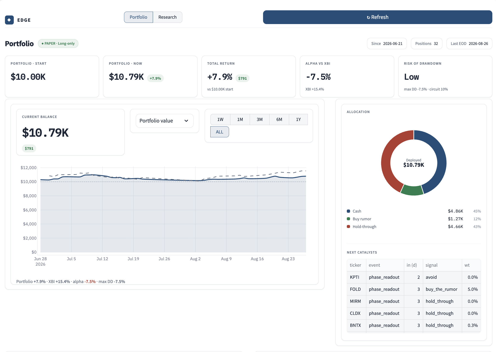
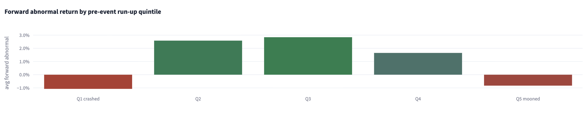
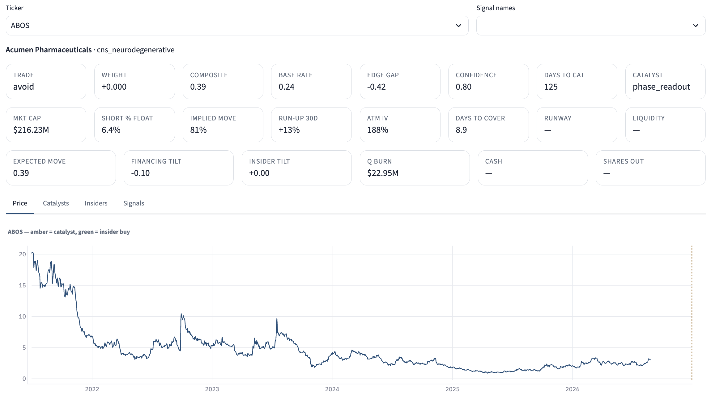
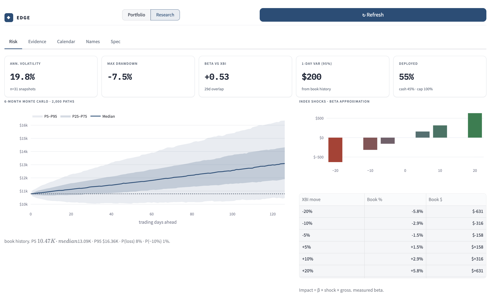

# Biotech Catalyst Edge Engine

I built this to answer one question: for a binary biotech event like a Phase 2 readout or an
FDA decision, can you predict the stock's reaction well enough to trade it? The most useful
thing I found is a negative result. Working from about two thousand real 8-K reactions and
testing on the 609 held out of sample, pre-event price action called the direction of the move
47.6% of the time, worse than a coin flip. So the engine never bets on direction. It bets on
two things I can actually measure: the historical base rate of a trial succeeding, and the gap
between the move I expect and the move the options market has already priced.



*The paper book on 2026-08-27, drawn from the daily run: equity versus the XBI biotech index, how the capital is currently allocated, and the catalysts due next.*

## Why I built it

My brother was diagnosed with a rare heart condition. I could not do anything about the
diagnosis itself, so I did the one thing I could and read everything I could find on it: papers,
trial registries, regulatory filings. By the end of that I could read a clinical trial properly,
and I had picked up something that mattered well beyond his illness. In a lot of medicine, years
of work and a company's entire future come down to a single dated readout that either works or
does not.

His condition is too rare to do statistics on, because a handful of trials is not a dataset. But
the habit of reading trial data transferred to a corner of the market where there are thousands
of those dated, binary events, each with real capital riding on it. That is what pulled me into
biotech, and it is why the folklore around these events, buy the run-up into a readout and sell
before the print, annoyed me enough to test it properly.

I did not want folklore, I wanted a number. So I built the pipeline around measuring my own ideas
and throwing out the ones that failed. Every claim in here is backed by a script and a validation
number, and where something did not work I left it in the repo with the result written next to
it, rather than quietly deleting it. That is the opposite of a backtest that only shows its good
days.

## How it works

The pipeline runs once a day on GitHub Actions and writes everything to Postgres (22 tables).

- Ingest: upcoming catalysts from ClinicalTrials.gov, financials plus 8-K and Form 4 filings
  from SEC EDGAR, and prices and options-implied moves from yfinance. I filter to small-cap
  oncology and CNS names at ingestion, with glioblastoma flagged as the flagship cluster.
- Grade each catalyst on a weighted average of three inputs: how soon it lands (0.25), the
  trial's historical base rate (0.45), and whether the company has the cash to survive to its
  own readout (0.30). The base rate carries the most weight because it is the only input I
  validated.
- Price the mispricing: expected move minus options-implied move gives an edge gap. Positive
  means the market underprices the event, negative means it is paying up for a coin flip.
- Decide and size: each name becomes ride-the-rumor, hold-through, or avoid, sized by a
  quarter-Kelly fraction and capped at 5% per name and 25% across the correlated glioblastoma
  cluster.
- Manage risk end of day: a 15% per-name stop, graded drawdown tiers, and a regime filter that
  de-risks when XBI closes below its 20-day average. Each overlay can only cut exposure.

Everything is paper and marked at prior close. The daily cadence is a design choice, not a
limit: every input is end-of-day data, so polling more often would add cost and rate-limit
risk without adding signal.

## The result

These are the validation numbers the engine is built on, each reproducible from the named
script on a temporal holdout (train before 2019, test after).

| Question | Finding | Verdict |
| --- | --- | --- |
| Can trial success be predicted? | Brier skill +0.098 over the prior, AUC 0.676, well calibrated (n=10,127) | Validated |
| Does price action predict reaction direction? | No: out-of-sample R² −0.001, 47.6% hit rate (n=609) | No edge, not wired in |
| Does price action predict reaction magnitude? | Weakly: R² +0.019, predicted-big names realized 13.9% versus 7.8% | Used for sizing only |
| Does a logistic model beat the base-rate lookup? | No: AUC 0.655 versus 0.672, and worse calibrated | Lookup kept |

The direction result is the load-bearing one. Sorting events into quintiles by their 30-day
run-up into the catalyst shows no monotonic link to the forward move: the biggest run-ups do
not lead to the biggest or the most predictable reactions.


*Forward abnormal return grouped by how much each name ran up before its catalyst. If price action predicted direction this would slope cleanly; it does not, which is why no chart-based direction signal is wired into the book.*

Because I trust the base rate and not the direction, the same discipline retired the short book
entirely. The engine is long-only, and reaction magnitude is used only to size the smallest,
most volatile names down, never to pick a side.


*One name's full picture: composite grade, trial base rate, edge gap, runway, and implied move, all in one view before any capital is committed.*

## What it doesn't do

The validated model predicts trial success, not stock returns. It is a feature, not a
profit-and-loss engine.

The live book is young and it is losing to its benchmark. Over the window shown it is up 7.9%
while XBI is up 15.4%, so the alpha is negative, and 442 closed trades is nowhere near enough to
call an edge either way. I would rather show that than a curve fitted after the fact.

The edge gap measures the size of the expected move against the implied move, not a signed
return, so it screens for mispricing rather than forecasting direction. Historical implied-move
and short-interest snapshots cannot be reconstructed, so the edge gap itself is not yet
backtestable. The universe is today's listed names, which carries survivorship bias, and since no
real money is at risk there is no transaction-cost, borrow, or slippage model. The
resolved-catalyst calibration sample is still nearly empty, so that number means little until the
forward book actually resolves.


*The risk view on the same book: a 2,000-path Monte Carlo of the next six months, annualized volatility of 19.8%, a −7.5% max drawdown, and beta of 0.53 to XBI.*

## Running it

You need Python 3.12+ and a Postgres database (a free Supabase project, or a local
`docker compose up -d`). macOS still ships `python3` as 3.9, which cannot install the pinned
dependencies, so do not use it. From the repo root:

```bash
./scripts/launch_terminal.sh
```

That finds a 3.12+ interpreter (or downloads one), builds the virtual environment, starts
Postgres (Docker if a daemon is already running, otherwise an embedded server, so Docker Desktop
is not required), and opens the terminal at http://localhost:8321. To see the live paper book
instead of an empty local database, paste a real Supabase connection string into `.env`.

To run the pipeline itself rather than just the UI:

```bash
python scripts/apply_schema.py   # create the 22 tables (idempotent)
python scripts/refresh_all.py    # full pipeline: ingest, score, validate
```

The one real gotcha: SEC ingestion fails fast unless `SEC_USER_AGENT` is a descriptive
"Name email" string, which EDGAR's fair-use policy requires.

## Development

`python -m pytest` runs the suite: 224 pass, and 7 database-backed tests skip automatically when
`DATABASE_URL` is absent. Formatting is `black` and `isort`, linting is `pyflakes`, and the config
lives in `pyproject.toml`. Every database write uses an idempotent upsert so the daily job can be
re-run safely. If you want the deeper design notes and the specific database traps I hit, they are
in [docs/HANDBOOK.md](docs/HANDBOOK.md), and the full run order is in
[docs/PIPELINE.md](docs/PIPELINE.md).
